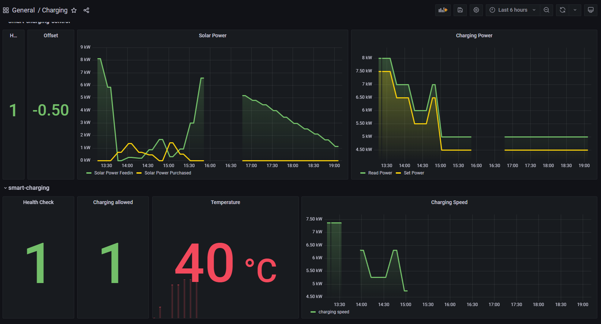

# Smart - Charging - Control

This project is the complement to [github.com/obrhubr/smart-charging](https://github.com/obrhubr/smart-charging). I run this app on my homelab server to sync the power usage of my solar panels with the charging speed of my electric car.

### Dashboard

I use my self-hosted Grafana Dashboard to monitor this service and [smart-charging](https://github.com/obrhubr/smart-charging), which is running on a Raspberry Pi and interfaces directly with the charging station.

